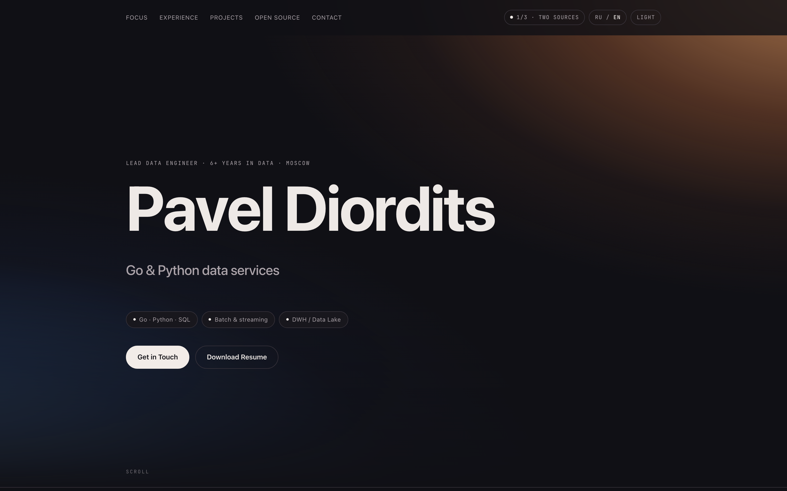
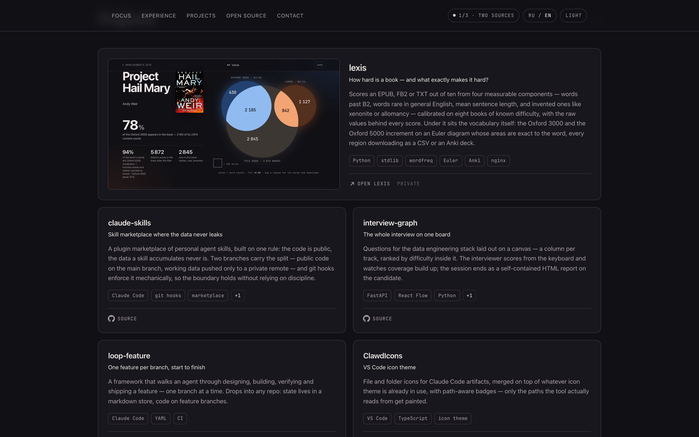
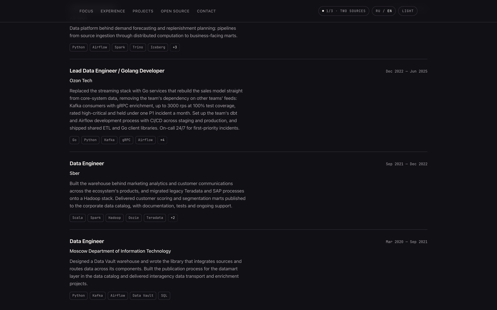
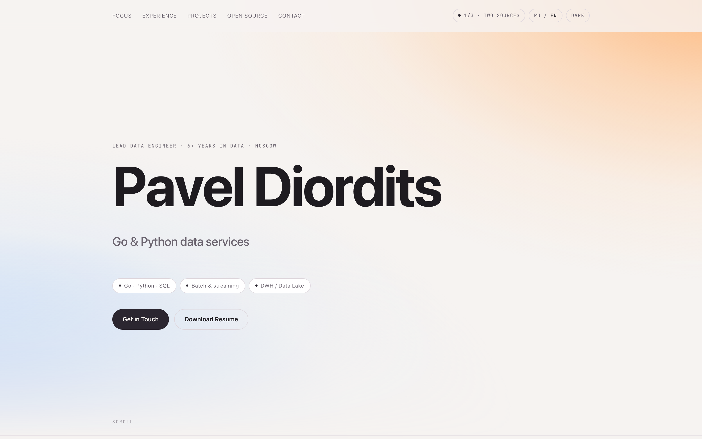
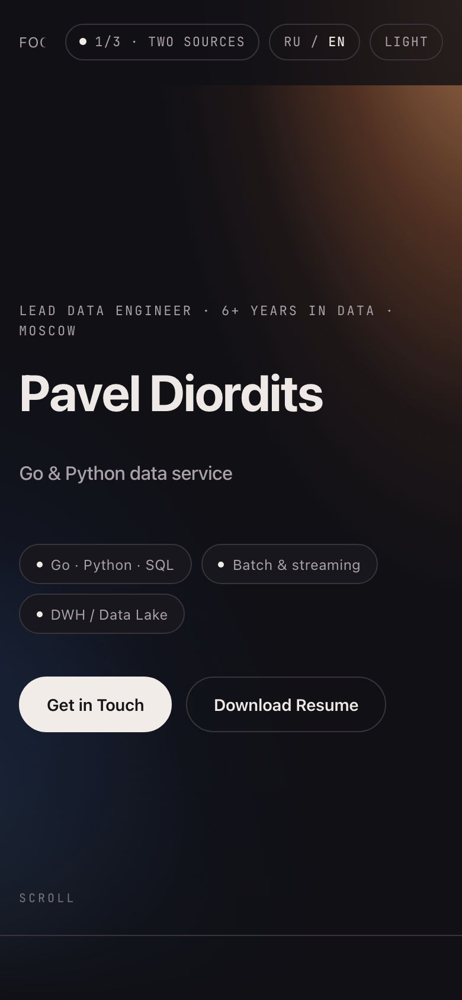

# portfolio

Одностраничный сайт-портфолио. Один самодостаточный файл — `index.html`: разметка, стили и данные
внутри, без сборки, зависимостей и внешних запросов. Открывается двойным кликом, кладётся на любой
статический хостинг как есть.

## Как выглядит



| | |
| --- | --- |
| **Проекты.** Карточки с подзаголовком-тезисом, стеком и ссылкой на исходники; приватные помечены.<br><br>[](docs/screenshots/02-projects.png) | **Опыт.** Хронология с датами моноширинным, компанией акцентом и коротким описанием роли.<br><br>[](docs/screenshots/03-experience.png) |
| **Светлая тема.** Переключается в шапке, выбор запоминается.<br><br>[](docs/screenshots/04-hero-light.png) | **Мобильный экран.** Навигация в одну строку с прокруткой, крупная типографика.<br><br>[](docs/screenshots/05-mobile.png) |

Пересобрать скриншоты (сайт по-прежнему без зависимостей — playwright ставится рядом,
`node_modules/` в `.gitignore`):

```bash
npm i --no-save playwright && npx playwright install chromium
node tools/screenshots.mjs        # → docs/screenshots/
```

## Что внутри

- Тёмная и светлая темы, выбор запоминается в `localStorage`, по умолчанию берётся системная.
- Два языка (RU/EN) — переключатель в шапке, выбор тоже запоминается.
- Печатающаяся строка в шапке, появление секций при скролле, липкая навигация.
- Секции: hero → сильные стороны → опыт и образование → проекты → open source → журнал → контакты.

## Как править контент

Весь текст лежит в одном месте — объект `T` в конце файла (плюс `ME` с именем, почтой и профилями).
Каждое поле — пара `{ en: "...", ru: "..." }`; правишь только её, разметку трогать не нужно.

- новое место работы — скопировать блок в `T.experience` (первый в списке = самый свежий);
- новый проект — блок в `T.projects`; `feature: true` растягивает карточку на две колонки,
  `source: "https://..."` добавляет ссылку на исходники, без него карточка помечается «Приватный»,
  `live: "https://..."` добавляет вторую ссылку — на работающий сайт проекта (поля независимы:
  у lexis сайт публичный, а код закрыт, поэтому в карточке и ссылка, и пометка «Приватный»);
- `viz: "lexis"` кладёт в карточку снимок продукта; сам снимок описан в объекте `VIZ` —
  базовое имя файла и `alt` парой `{en, ru}`. Файлов два, `<имя>-light.webp` и `<имя>-dark.webp`:
  `syncThemeLabel()` подменяет `src` по теме, потому что тёмный кадр на светлой странице
  читается как поломка. Новые снимки класть рядом с `index.html` и вносить в `deploy.manifest`,
  иначе на сервер они не поедут;
- верхняя лента — `T.focus`, ровно пять пунктов ложатся в строку на широком экране;
- ссылки в подвале контактов — `T.socials`.

Цвета, шрифты и радиусы — CSS-переменные в `:root` и `html.dark` в начале файла.

## Журнал — раздел разборов

`presentations/` — html-страницы, которые делает скилл `present-html`, и страница журнала
`presentations/index.html` поверх них. Адрес — `paveldiordits.site/presentations/` (менять его нельзя:
по нему уже расшарены ссылки). В шапке сайта пункта нет: на главной есть секция «Журнал» с тремя
последними записями, её содержимое вшивает публикатор — см. ниже.

Записи разложены по полкам: серия, а если её нет — направление. Внутри полки новые сверху.

Скилл кладёт пару `<name>.md` + `<name>.html` в `~/dev/docs/<тема>/`; там остаётся источник правды
содержания и всё, что публиковать не нужно. На сайт файл попадает только явной командой — публикация
не должна быть побочным эффектом генерации, иначе рабочие документы из `~/dev/docs/rabota/` однажды
уедут на публичный адрес.

```bash
node tools/publish-presentation.mjs ~/dev/docs/lichnoe/research/тема-2026-09-04.html \
  --slug тема --topic ai --desc "Одна-две строки о чём разбор." \
  [--series "Agents Weekly"] [--tag тег] [--date YYYY-MM-DD] [--lang en] \
  [--feature] [--pick] [--unlisted]

node tools/publish-presentation.mjs --unpublish тема   # снять с сайта
node tools/publish-presentation.mjs --rebuild          # пересобрать, ничего не добавляя
```

Дальше обычный `git push` — выкладку делает тот же workflow по манифесту.

### Ключи

- `--slug` — имя в URL. Обязателен: имена файлов в `~/dev/docs` не годятся (там лежат `review.html`
  и `fix_report.html`).
- `--topic` — направление; красит маркер в строке записи и обложку. Список — в `TOPICS` внутри скрипта.
- `--series` — если разборов одного замысла несколько (`Agents Weekly`, `Product Lab`). Полки страницы
  строятся по сериям, а не по тегам: серия задаётся в `GROUPS`, там же её порядок и пояснение.
  Разбор чужого репозитория, плагина или пака скиллов всегда публикуется с
  `--series "Разборы репозиториев"` — у них своя полка, в общую «Агентную разработку» они не идут.
- `--feature` — единственная рекомендуемая, она стоит на первом экране; новая снимает флаг с прежней.
- `--pick` — метка «Лучшее» на обложке записи. `--feature` её включает автоматически.
- `--unlisted` — «по ссылке»: файл уезжает на сервер и открывается по прямому адресу, но в журнале
  не показывается. «Черновик» и «приватная» — это просто неопубликованный файл, он остаётся в `~/dev/docs`.
- Заголовок берётся из `<title>`, время просмотра считается по числу слов, а заголовки разделов ложатся
  в реестр ключевыми словами — поэтому команда работает и со старыми файлами, ничего в них не правя.

### Что происходит при публикации

- **Предполётный контроль.** Есть ли `<html>`, `<meta charset>` и viewport. Без `<html>` сервер выкладки
  отвергнет файл и уронит весь деплой; без charset кириллица останется на усмотрение браузера
  (nginx отдаёт `text/html` без него); без viewport страница откроется на телефоне свёрстанной под
  десктоп. Отдельно предупреждает, если страница тянет стили или скрипты со стороны.
- **Обложка.** Настоящих обложек `present-html` не делает, поэтому рисуется заглушка
  `presentations/covers/<slug>.svg` — детерминированная по слагу, в цвете направления. Положишь свой
  файл под тем же именем — генератор его не тронет.
- **Дописки в копию.** В скопированный html добавляются og-теги (иначе ссылка в телеграме выглядит
  голой), кнопка «← Назад» в начале `<body>` и подвал с возвратом в журнал и блоком «ещё по теме».
  Всё между маркерами `<!--general:head-->`, `<!--general:top-->` и `<!--general:foot-->`; перед каждой
  сборкой прошлая вставка вырезается, поэтому пересборка не наслаивает блоки. Исходник в `~/dev/docs`
  не трогается.
- **Кнопка возврата.** Настоящая ссылка на журнал, но если посетитель пришёл по ссылке с сайта, по
  клику делается `history.back()` — возврат на ту страницу и в ту точку прокрутки, откуда он ушёл.
  Стоит первой в `<body>`, а не поверх страницы: у части выпусков ровно там свой переключатель темы,
  и фиксированная кнопка его накрывала. `sticky` держит её на виду при прокрутке.
- **Повышенный контраст снят.** Каждый генератор делал его по-своему — кнопки `#contrastBtn`,
  `#btn-contrast`, `#ct`, `#hc`, `#hcBtn`, состояние то в `data-contrast="on"`, то `="high"`, то классом
  `.hc` на `<html>`. Вставка не вырезает это из девяти разных файлов (их же скрипты держат ссылку на
  кнопку и упали бы на null, уронив заодно переключатель темы), а глушит: кнопка прячется, состояние
  снимается наблюдателем и не возвращается из `localStorage`.
- **RSS.** `presentations/rss.xml` собирается из того же реестра; `unlisted` в ленту не попадают.
  Даты сборки в файле нет намеренно — иначе каждый `--rebuild` давал бы дифф на пустом месте.
- **Блок на главной.** Три последние записи вшиваются в `index.html` между маркерами
  `/* ── journal:latest ── */`. Правки внутри блока теряются при следующей сборке, строки вокруг — твои.
- **Реестр** — `presentations.json` в корне. Он **не** в манифесте: это исходник сборки, браузер его
  не грузит.
- **Манифест.** Переписывается только блок под маркером, строки выше — твои.

### Оформление

Токены не копируются, а вынимаются из `index.html` при каждой сборке — три набора света × две темы
живут в одном месте, и журнал не может разъехаться с главной. Правишь `:root` в `index.html` —
прогоняешь `--rebuild`. Переключатели темы и набора работают на тех же ключах `localStorage`, что и
на главной, поэтому выбор переносится между разделами.

Саму страницу руками не правь, она генерируется: шаблон — `tools/journal-page.mjs`, лента —
`tools/rss.mjs`, обложки — `tools/cover.mjs`.

Поиска по журналу нет: полок с пояснениями хватает, чтобы найти нужное глазами, а индекс в разметке
стоил бы веса на каждой загрузке. Ключевые слова в реестре остаются — если поиск понадобится, он
соберётся из них.

Чего на статике нет и не будет: счётчика просмотров, сортировки по популярности и режима владельца
с правкой из браузера — всё это требует бэкенда и авторизации, а сайт заявлен как статика без трекеров.
Их роль играет CLI выше.

### Поддомен

DNS `presentations.paveldiordits.site` → 37.46.132.95 уже есть; на сервере не хватает server-блока
nginx с `root …/presentations;` и сертификата на это имя. Каталог выбран так, чтобы включение не
требовало правки выкладки: когда vhost появится, меняется только `BASE` в скрипте, дальше `--rebuild`
(он же перепишет ссылки в блоке журнала на главной).

## Что нужно дозаполнить

Обе вещи ниже выключены комментарием, чтобы на странице не висело битых ссылок.

- Кнопка «Скачать резюме» в hero-секции — положи `resume.pdf` рядом с `index.html`
  и раскомментируй строку с `href="resume.pdf"`.
- Telegram в `T.socials` — раскомментируй блок и подставь ник.

## Публикация

GitHub Pages: создать репозиторий, положить `index.html` в корень, включить Pages из ветки `main`.
Любой другой статический хостинг (Netlify, Cloudflare Pages, nginx) — просто отдать файл.
